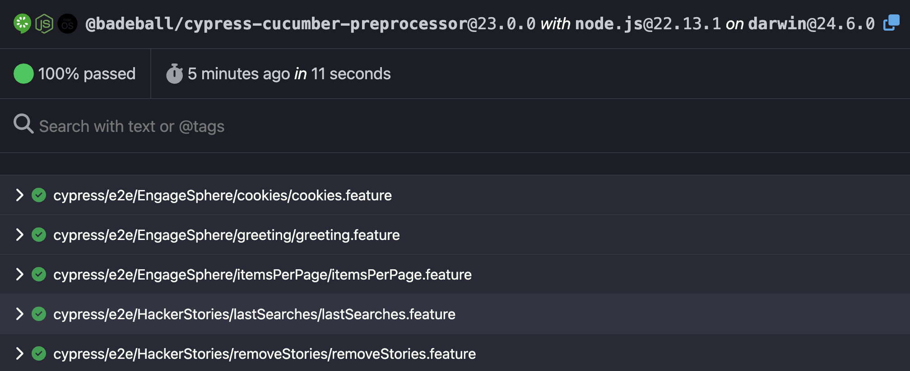

# Relatório HTML

Uma das vantagens da integração do Cypress com o Cucumber é a facilidade da geração de um relatório dos testes em formato HTML.

Basta criar (na raiz do projeto) um arquivo oculto chamado `.cypress-cucumber-preprocessorrc.json` com o seguinte conteúdo.

```json
{
  "html": {
    "enabled": true
  }
}
```

E ao executar os testes em modo _headless_ (com o comando `npx cypress run`), o arquivo `cucumber-report.html` será automaticamente gerado, semelhante ao exemplo abaixo.



> 👨‍🏫 Recomenda-se que o arquivo `cucumber-report.html` seja listado no arquivo oculto `.gitignore`. Dessa forma, o relatório não será versionado.
>
> O relatório não é versionado pois é um artefato da execução dos testes, e a cada nova execução, seu conteúdo é sobrescrito.

## Exercício 🎯

1. Crie o arquivo `.cypress-cucumber-preprocessorrc.json` conforme descrito acima
2. Execute os testes em modo _headless_
3. Compartilhe uma _screenshot_ do relatório em suas redes sociais! 📱

## Mostre ao mundo o que você aprendeu 🌎

Para mostrar à sua rede profissional o que você aprendeu nesta aula, publique o seguinte no LinkedIn.

> Estou fazendo o curso "Testes End-to-End com Cypress e Cucumber: Guia Definitivo 🥒" da escola online Talking About Testing, onde aprendi a configurar um relatório HTML da execução dos testes. #TalkingAboutTesting #EscolaTAT #Cypress #Cucumber
>
> 👨‍🏫 Lembre-se de me marcar em sua publicação. [Aqui está meu perfil no LinkedIn](https://www.linkedin.com/in/walmyr-lima-e-silva-filho).

___

Agora que você sabe gerar um relatório da execução do testes, [vamos configurar o projeto para execução dos testes não só localmente, mas também em uma esteira de integração contínua](./12.md).

___

[Voltar para a página inicial](../README.md)
